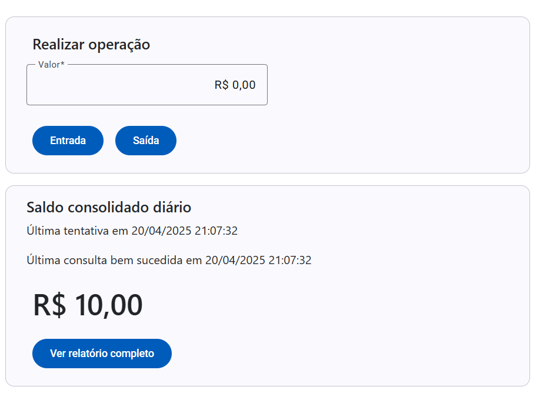

# Gestor de caixa
Um comerciante precisa controlar o seu fluxo de caixa diário com os
lançamentos (débitos e créditos), também precisa de um relatório que
disponibilize o saldo diário consolidado.

## Instalação

Para instalar o iniciar é necessário ter o Docker instalado.
https://www.docker.com/

Após a instalação do docker, navegue até o diretório GestaoCaixa e execute o seguinte comando pelo CMD.
* docker-compose build
* docker-compose up

Você pode acessar os containers através dos links abaixo.

* Front end http://localhost:18083
* Gateway http://localhost:18080
* API GestaoCaixa http://localhost:18081/
* API SaldoConsolidado http://localhost:18082/
* API Gateway http://localhost:18080/
* Logs http://localhost:8081
* RabbitMq http://localhost:15672/

##  System Context Diagram
   

## Container Diagram
   

## Serviços
Foram construídos 2 serviços (Gestão fluxo de caixa e Consulta Saldo).
Para garantir que o Serviço gestão de fluxo de caixa funcione de forma indepente foram adicionadas as seguintes implementações:

## API GestaoFluxo
Utilizei o RabbitMq para se comunicar com a API ConsultaSaldo e para garantir que mesmo que a API Consulta Saldo e o RabbitMq  esteja fora, a API fluxo de caixa permanece ativa e operando, utilizei o Pattern OutBoxMesage

   

## API SaldoConsolidado
Consulta informações da fila e insere as informações na sua própria base de dados.

Obs: Para incrementar ou decrementar o saldo do usuário eu poderia consultar, somar e 
depois fazer o update, mas para isso eu precisaria incrementar um mecanismo de lock da tabela
para garantir que o saldo não fosse alterado por concorrência. Então resolvi utilizar o dapper e fazer
o script de consulta e inserção na mesma query.

## API Gateway
Utilizei o Ocelot para criar uma API Gateway simples para centralizar os endpoints, autenticação e RateLimit.
Normalmente se utiliza autenticação nos dois lados, Gateway e API, mas neste caso optei por adicionar uma chave pública no 
Gateway e quando alguma requisição chega em uma das API, esta chave pública é consultada no Gateway
para verificar a Origem do Token. Assim garantimos que o Token gerado tem a origem API gateway.

   

## Testes de performance
Utilizei o k6 para testes de performance.
Para testar navege até a pasta GestaoCaixa/performance-tests.
Abra o arquivos .js criar-lancamento-test.js, substituia a variavel TOKEN por um token válido

1- Instale o K6 no terminal ubunto, se estiver utilizando windows sugiro abrir um terminal Ubuntu WSL
. Link para instalação: https://grafana.com/docs/k6/latest/set-up/install-k6/

Após instalação, execute o seguinte script:
* K6_WEB_DASHBOARD=true k6 run criar-lancamento-test.js

Você pode acompanhar os testes via cmd ou pelo link gerado. 
http://127.0.0.1:5665

* Ao gerar os testes com 50 requisições por segundos, algumas requisições demoraram mais de 1 
segundo para concluir, em um cenário futuro uma sugestão seria o aumento da quantidade de instancias
ou um serviço de auto scale para melhorar a velocidade das requisições.

   

## Logs
Para acessar os logs acesse o link 
* http://localhost:8081/
* Pontos futuros de melhoria seria adicionar autenticação no LOG

## Front End
Para acessar o front end acesse o link 
* http://localhost:18083/
* Para poupar tempo, ao inves de criar um gerenciamento de usuários, eu criei apenas um ID de usuário GUID
No painel inicial do FrontEnd, se você adicionar um GUID novo, a aplicação irá criar um novo usuário e irá logar,
caso você utilize um guid existente, a aplicação irá pegar o usuário existente.
* No painel Front end é posível realizar entradas e saídas
* A consulta do saldo consoidado acontece em tempo real, também é mostrado
a última tentativa de requisição e a data da última tentativa bem sucessida.
* Como melhoria futura ficou o relatório completo das transações diárias

   

## Banco de dados 
Banco de dados relacional MySql.

## gestao-fluxo
   

## saldo-consolidado
   

# Tecnologias utilizadas
1. FluentValidation
2. Mediator + Behavior (Pipeline)
3. Outbox pattern
4. Entity Framework
5. BackgroundServices
6. Dapper
7. Serilog + Logs + Seq
8. Ocelot api gateway
9. Jwt
10. MySql
11. Net 8
12. Docker
13. Docker Compose
14. Minimal API

## Melhorias Futuras

* Criação de usuario para usar o rabbit (evitar usar guest)
* Cofre para salvar credenciais
* O identity server (responsavel geração de token) está na API Gateway, e normalmente deveria ser um componente separado (keyclock, identityserver4, cognito, ...)
* Orquestrador de containers
* Grafana

 
